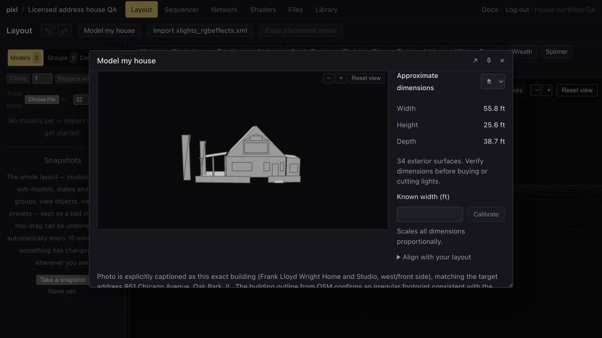
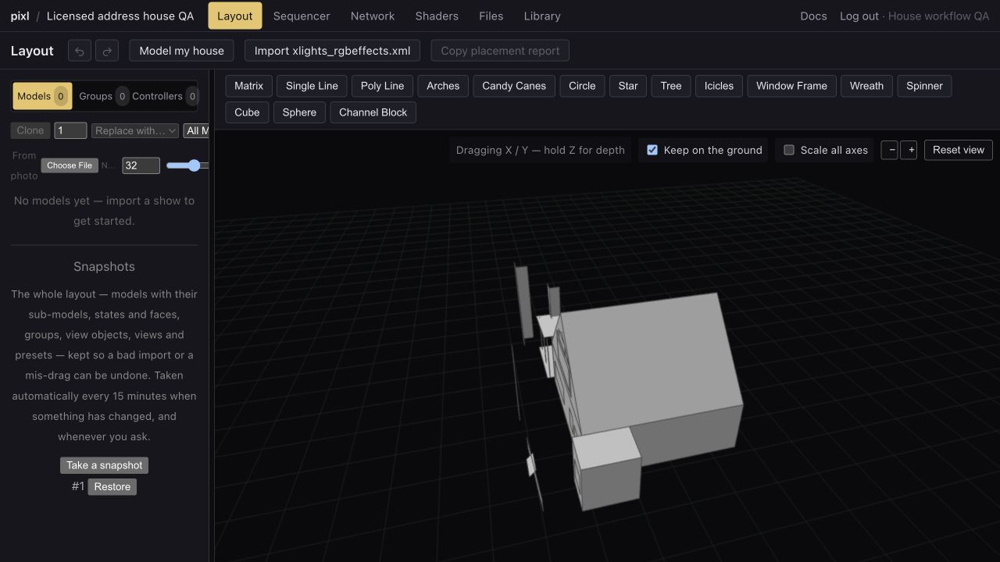
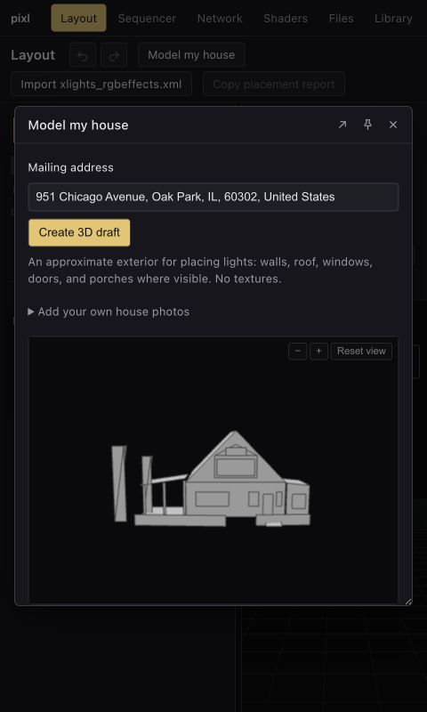
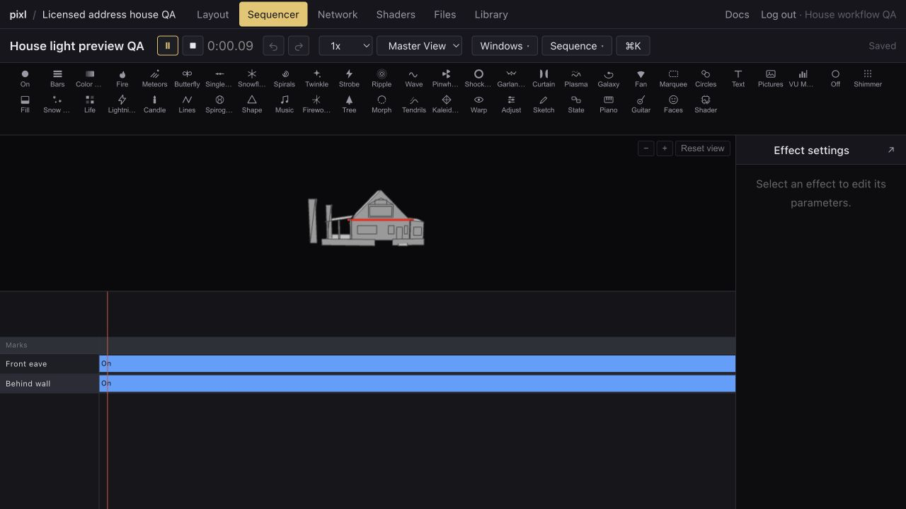
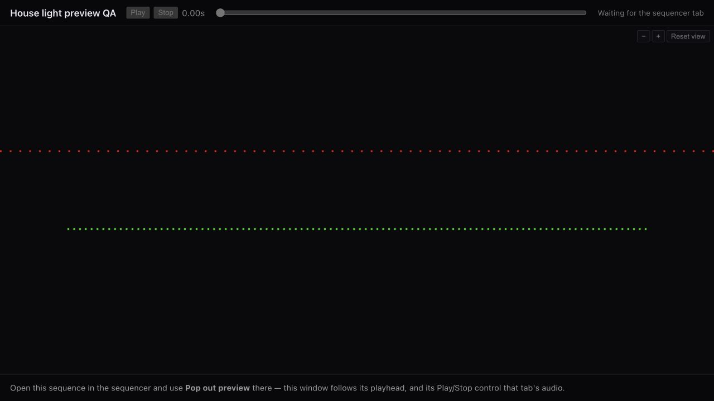
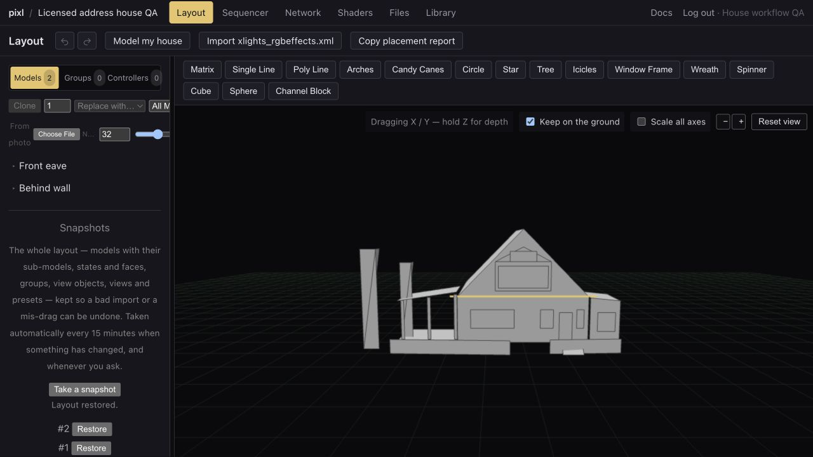

# House modeling — removed

“Model my house” is no longer available. The upload dialog, address lookup, and AI generation have been removed. Requests from old tabs receive HTTP 410 without contacting a provider. Existing saved house geometry, layout snapshots, and rendering remain compatible.

The sections below are historical implementation and verification notes, not current setup instructions. House generation environment variables are no longer read.

---

# House modeling

Layout → Model my house now starts with 1–4 uploaded photos. Use a clear front photo first, then angled and side views showing the roof and porch. No address lookup or reference measurement is required. Photos must be owned by the user or used with permission.

The model estimates relative proportions using the visible house, doors and storeys. New drafts are centered horizontally, grounded, and scaled uniformly to the empty layout's 200-unit span, with the frontmost surface at Z=0. Geometry retains its estimated meter coordinates; placement scale is for the editor, not a physical measurement. The default camera fits the house and existing lights together, including narrow panes. A Fit to default layout button resets placement; manual placement remains available. Existing saved houses are not rescaled merely by opening them.

Review and save the draft. Saving or removing first creates a layout version, with revision checks for concurrent edits. Hidden openings are not invented; estimates are available under Estimated details and sources. No approximate feet/meters or calibration step is required in the upload flow.

The earlier address-based API remains for compatibility with already-open clients. It is no longer exposed in the dialog; normal photo uploads make no mapping or public-imagery calls. Legacy source credits are preserved on saved models. Uploaded-only drafts do not claim OSM attribution.

## Sources and configuration

- Photon geocodes addresses; a house number is required in a match. Public calls are globally limited to one per second and cached for 10 minutes. Configure `HOUSE_GEOCODER_URL` for an owned/commercial Photon deployment at scale.
- The selected OpenStreetMap object supplies footprint/tags, cached 24 hours. OSM contributors are credited under ODbL 1.0.
- KartaView supplies processed street photos, filtering by distance and camera direction. Public requests are limited to 90/hour per server, within its 100/hour unauthenticated allowance. Photos and derived geometry retain CC BY-SA 4.0 attribution. API: https://kartaview.org/doc/photos
- Exact-building Wikidata P18 links can supply Wikimedia Commons photos when street coverage is missing. Only CC BY, CC BY-SA, CC0, public-domain, and the Commons Attribution license are accepted; no noncommercial/no-derivatives photos. Source links, author and license persist with geometry.
- Google Earth and Street View are not sources for derived geometry.
- `HOUSE_ANTHROPIC_KEY` overrides the existing `ANTHROPIC_API_KEY` or Anthropic `SHADER_API_KEY`. Never put keys in browser configuration. `HOUSE_MODEL` defaults to `claude-sonnet-5`. Strict tool schemas and server geometry validation reject incomplete/malformed responses. See https://platform.claude.com/docs/en/agents-and-tools/tool-use/strict-tool-use
- `HOUSE_MONTHLY_LIMIT` defaults to 10 attempts/user/month (UTC). An attempt is recorded immediately before the paid model call, including failed calls. Address searches and missing imagery do not use the allowance. Retries with the same request ID return a cached successful draft for 10 minutes without another paid call.

Use a shared database cache across web workers. The server needs outgoing HTTPS to the source providers and Anthropic. Nginx allows 360 seconds on the generation route; source lookup has an 80-second overall budget and API model calls have a 240-second limit. Draft locks last 400 seconds, beyond the combined source and generation budgets. Provider failures log only error class, HTTP status and elapsed time. Uploaded photos are reduced in-browser and validated again server-side. Remote downloads only use allowlisted hosts, no redirects, and bounded image sizes.

Geometry is saved in layout settings and shown in Layout, Sequencer, and Preview. Project viewers can read it; editors can generate/change it. Successful draft cache entries may contain the submitted photos for 10 minutes. Source metadata and address caches expire separately. Layout versions retain previous house geometry and attribution, as with other layout settings.

## Upload-first verification — 12 September 2026

- 543 web tests and 180 API tests / 698 assertions passed, plus frontend lint, type checks and production build. The existing bundle-size warning remains.
- A browser selected and removed a real photo; generation enabled only with an image and required neither an address nor a measurement.
- A previously saved 34-surface house was fitted and saved through the dialog, then reloaded. Database bounds confirmed horizontal centering, ground Y=0, frontmost Z=0 and largest dimension 200 units, with all surfaces retained.
- Desktop and 480 × 800 browser views showed the house in the default camera and kept the upload, fit and save controls reachable. Wheel gestures over the 3D preview zoom the camera; scrolling the surrounding dialog moves its content.
- The no-address API regression verifies no geocoder/imagery calls, no allowance spent without a photo, idempotent generation, unchanged layout until save, and no spurious OSM credit for photo-only geometry.

## Verification — 12 September 2026

A local browser run entered **951 Chicago Avenue, Oak Park, Illinois 60302** (Frank Lloyd Wright Home and Studio), obtained a live Photon match and OSM footprint, and generated 34 surfaces from a live Commons photograph through Anthropic. All six surface kinds were present. This was actual address-driven generation, not the synthetic geometry fixture.

The source photograph is [Frank Lloyd Wright Home and Studio (west side zoom)](https://commons.wikimedia.org/wiki/File:Frank_Lloyd_Wright_Home_and_Studio_(west_side_zoom).JPG), by **John Delano of Hammond, Indiana**, under the Commons **Attribution** license. OSM building data: [way 25885716](https://www.openstreetmap.org/way/25885716), OpenStreetMap contributors, ODbL 1.0. The screenshots below show a simplified derivative of that photo and mapped information. They do not establish current conditions or survey accuracy; rear surfaces and chimney faces remain approximations.

Verified browser actions:

- Address → 3D draft → inspect photo attribution → calibrate width → Save house to layout.
- Reload and reopen: same 34 surfaces, credits and calibrated dimensions. The 56 ft width was a test calibration value, not a measured width of the building.
- Orbit exposed roof and side volumes; 480 × 800 layout kept the house form usable.
- Address change cleared the prior draft and disabled Save. An unmapped test address offered own photos without calling the model or modifying the saved house.
- Sequencer playback with two test light rows: red lights in front visible, green lights behind the walls occluded. Removing the house exposed both rows; restoring its automatic snapshot recovered the geometry and retained both light models.
- No browser console errors in the final restored state.

Automated verification: 1,470 JavaScript tests (839 engine, 73 formats, 542 web, 16 tools), 178 API tests / 681 assertions, type checks, lint, and production build passed. The existing large-bundle build warning remains. Independent review and targeted tests covered authorization, malformed geometry, source licensing/hosts, camera direction, source deadlines, independent throttle buckets, generation allowance/idempotency, unmapped-photo fallback and conflicting saves. Public KartaView returned no frames at this test address; its filtering/failure paths were tested with controlled responses. Public-photo coverage elsewhere and physical accuracy are not guaranteed.
